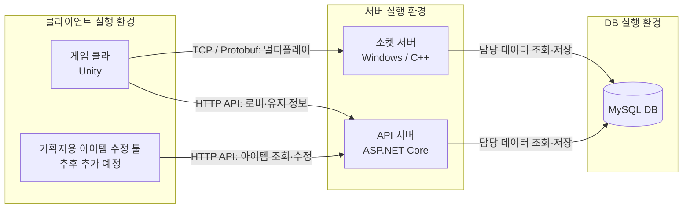

# ZPD

- **프로젝트 목표**
  - 클라이언트-서버-DB를 분리하여 시스템을 배치하고 연결해서 온라인 서비스 동작 구성
  - 기획자용 작업 툴 구현
  - 외부스키마&내부스키마 분리를 통한 시스템 보안 확보(DB유저 분리)
- **시스템별 역할**
  - 게임 클라: 유저의 게임 플레이
  - API 서버: 로비 및 기타 API 요청 처리
  - 소켓 서버: 멀티플레이 게임 진행
  - 기획 툴: 기획자용 아이템 수정 도구, 추후 추가 예정

## 시스템 배치

- **목표 배치(논리 구성)**: 게임 클라·기획 툴 → API·소켓 서버 → MySQL DB
- **연결 관계**: 게임 클라는 두 서버에 연결, 기획 툴은 API 서버로 아이템 조회·수정



- **DB 연동 현황**: API의 MySQL 연결 확인
- **구현 예정**: 로비·아이템·보상 API, 소켓 서버의 DB 연결, 기획 툴
- **미정 사항**: 실제 장비 구성, 서버 간 통신, 운영 배포 방식
- **설계 기준**: 기능별 데이터 수정 주체와 아이템 변경의 게임 반영 시점 정의
- **운영 API**: HTTPS 적용 예정

## 프로젝트 구성

- **저장소**: 세 프로젝트를 하나의 모노레포로 관리
- **빌드·실행**: 프로젝트별 진행
- **배포**: 프로젝트별 진행 예정, 자동화 미구현
- **통신 계약 변경**: 관련 클라·서버 변경을 같은 PR에 포함

| 경로 | 역할 | 현재 상태 |
| --- | --- | --- |
| [client](client/README.md) | Unity 6000.3.11f1 게임 클라이언트 | 로그인·로비 HTTP 클라이언트, MVC 솔로 디펜스, TCP 매칭 테스트 |
| [socket-server](socket-server/README.md) | C++20 / WinSock2 / IOCP 서버 | FIFO 매칭·세션·에코; 전투 틱·인증 미구현 |
| [api-server](api-server/README.md) | ASP.NET Core 10 / EF Core / MySQL | DB 연결 확인; 로비·보상 API 미구현 |
| [contracts](contracts/README.md) | TCP·HTTP 통신 계약 | 스키마·코드 생성·구현된 HTTP 명세 |
| [docs](docs/README.md) | 전체 구조·개발 규칙·설계 | 현재 상태와 제안·과거 문서를 구분 |
| [tools](tools) | 공통 빌드·실행·검증 | PowerShell 7에서 루트 기준 실행 |

## 기술 스택

- **게임 클라**: C#, Unity 6000.3.11f1
  - 렌더링: URP 17.3.0, 2D Renderer
  - UI·입력: Unity UI(uGUI) 2.0.0, Input System 1.19.0
  - HTTP 요청: UnityWebRequest
- **소켓 서버**: C++20, Windows, WinSock2, IOCP
  - 빌드·의존성 관리: CMake, vcpkg
- **API 서버**: C#, .NET 10, ASP.NET Core 10 컨트롤러
  - 데이터 접근: EF Core 10, MySql.EntityFrameworkCore
  - API 명세: ASP.NET Core OpenAPI
- **데이터베이스**: MySQL
  - 현재: API 연결 확인 / 예정: 소켓 서버 연동
- **통신 계약**: TCP·Protobuf, HTTP·JSON, OpenAPI
- **개발·검증**: Git, PowerShell 7, CTest, C# 통신 검증, Unity 에디터 검증
- **CI**: GitHub Actions 워크플로 설정, 원격 실행 미확인
- **기획 툴**: 추후 추가 예정, 기술 스택 미정

## 작업 가이드

- [작업 가이드 목록](docs/guides/README.md): 작성 항목·우선순위
- [공통 작업 순서](docs/guides/FEATURE_WORKFLOW.md): 시스템 연결·기능 추가
- [API 라우팅 추가](docs/guides/API_ROUTING.md): 요청 정의·구현·검증

## 준비

- **공통**: PowerShell 7, Git, .NET 10 SDK (`global.json` 기준)
- **소켓 서버**: Visual Studio 2026 C++ 도구, Windows SDK, CMake 4.2+, vcpkg
- **클라**: `client/ProjectSettings/ProjectVersion.txt`에 지정된 Unity
- **DB 연결 성공 확인**: MySQL과 접속 가능한 DB·계정 필요, 예시 DB 이름 `zpd`
- **명령 실행 위치**: 저장소 루트

```powershell
$env:VCPKG_ROOT = 'C:\vcpkg'  # 자신의 설치 경로
./tools/Build.ps1
./tools/Test.ps1
```

- **빌드**: 두 서버 대상, Unity 빌드 제외, 테스트 전에 실행
- **검증**: CTest, C# 실제 서버 통신, TCP 생성 일치, API 스모크·OpenAPI 일치
  - API 스모크: 별도 프로세스·실패용 DB 주소 사용, 개발 DB 접근 없음
- **Visual Studio 2022 사용 시**
  - CMake 3.25+ 및 `./tools/Build.ps1 -Generator 'Visual Studio 17 2022'` 사용
  - 기존 빌드 폴더의 generator가 다르면 새 체크아웃에서 빌드

## 실행

- **서버 실행**: 서버별 별도 터미널 사용

```powershell
./tools/Run.ps1 -Target Socket      # TCP 0.0.0.0:30000에서 접속 대기
./tools/Run.ps1 -Target Api         # HTTP http://localhost:5089
./tools/Run.ps1 -Target MockClient  # 127.0.0.1:30000에 접속; /match, /cancel, /leave
```

- **TCP 포트 설정**
  - 서버 기본값 `30000`, Unity `ConnectionTest` 초기값 `20000`
  - 위 명령 사용 시 클라의 Port를 `30000`으로 변경
  - `20000` 유지 시 `./socket-server/out/build/windows-x64/Debug/zpd-server.exe 20000` 실행
  - `Run.ps1`은 포트 인자 미지원, [설정 위치](docs/ARCHITECTURE.md#현재-개발-주소와-포트) 참고
- **API DB 연결**: 로컬 User Secrets에 실제 접속 정보 설정

```powershell
dotnet user-secrets set 'ConnectionStrings:DefaultConnection' 'Server=localhost;Port=3306;Database=zpd;User ID=zpd;Password=YOUR_PASSWORD;' --project api-server/src/Zpd.Api
```

- **Unity 실행**: Unity Hub에서 `client` 폴더 열기
  - `Login`: 빌드 시작 씬, 로그인 성공 후 로비 이동
  - `SoloDefense`: 솔로 게임
  - `ConnectionTest`: 두 클라이언트의 TCP 매칭
  - `Lobby`: 프로필·인벤토리·아이템 사용, 솔로 씬 진입
- **인증·로비·결과·보상 API**: 서버 미구현, 클라 요청 코드만 구현
  - 로그인과 실제 계정 데이터 조회·저장·보상 지급은 서버 구현 필요
- **클라 API 주소**: `LoginController.api_root`, 기본값 `https://127.0.0.1:18080/api/v1`
  - 로컬 API 기본 주소 `http://localhost:5089`와 다름, [클라 로그인 계약](client/Docs/LOGIN.md) 참고
  - 로그인 세션의 주소·토큰을 후속 요청에 사용
  - HTTP는 Editor/Development Build의 loopback에서만 허용, 배포 시 HTTPS 지정
- **Unity 검증**: 에디터 종료 후 컴파일·씬의 누락 스크립트 확인

```powershell
./tools/Test-Unity.ps1
./tools/Test-Unity.ps1 -Gameplay    # 인증·로비·UI 입력·솔로 플레이 자동 검증
```

- **플레이 검증**: 임시 프로젝트에서 실행, HTTP는 테스트 서버 사용, UI 입력 검사는 Direct3D 11 사용
  - [클라이언트 갱신 검증 결과](docs/CLIENT_IMPORT_VALIDATION.md)

- **VS Code**: `zpd.code-workspace`에서 프로젝트별 디버깅·루트 작업 사용

## 계약 변경

```powershell
./tools/Generate-Protocol.ps1       # TCP C# 메시지와 C++/C# 코드 상수 생성
./tools/Generate-Protocol.ps1 -Check
./tools/Build.ps1 -Target Api
./tools/Export-OpenApi.ps1          # 실제 구현에서 HTTP 명세 추출
./tools/Export-OpenApi.ps1 -Check
```

- **TCP 원본**: `contracts/realtime`
- **HTTP 원본**: API 구현
- **생성 파일**: 직접 수정 금지, 원본 변경 후 재생성·검증
- **미구현 API**: [설계 초안](docs/design/API_IMPLEMENTATION.md) 참고

## Git과 CI

- **원격 저장소**: [BaeJiwoo/zpd](https://github.com/BaeJiwoo/zpd), 루트 `origin`으로 연결
- **개발 흐름**: `main` 기준, 기능별 짧은 브랜치·PR 사용
- **GitHub Actions 설정**
  - 실행 조건: 모든 PR, `main` 푸시
  - 검증 작업: 소켓·클라 네트워킹 / API
  - 브랜치 보호 설정 시 최종 `CI` 체크 필수 지정
- **Unity 검증**: 라이선스·에디터가 설치된 로컬 환경에서 별도 실행
- **후속 확인·설정**: 원격 CI 결과 확인, 브랜치 보호
- **관련 문서**: [기여 규칙](CONTRIBUTING.md), [구조와 책임](docs/ARCHITECTURE.md), [이력 이전·복구](docs/MIGRATION.md)
