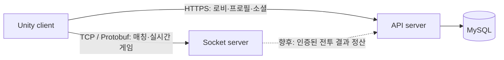

# 구조와 책임

위 그림은 목표 책임 경계입니다. 현재 API는 DB 연결 확인만, 소켓 서버는 매칭·세션·에코만 구현되어 있습니다.
전투 결과 전달, 인증, 프로필·보상 저장은 아직 구현되지 않았습니다.

| 프로젝트 | 소유하는 책임 | 다른 영역과의 경계 |
| --- | --- | --- |
| client | 입력·화면·연출·로컬 솔로 플레이 | 영속 재화·멀티플레이 판정은 서버 결과로 반영 |
| socket-server | 접속·매칭·세션, 향후 실시간 전투 판정 | DB 계정·로비 CRUD를 직접 소유하지 않음 |
| api-server | 계정·프로필·소셜·인벤토리·보상의 영속 상태 | 매 프레임 입력·위치 동기화는 소켓 서버 책임 |
| contracts | 전송 메시지·코드·호환 규칙 | C++·Unity 런타임 구현을 공통 라이브러리로 강제하지 않음 |

멀티플레이 결과는 향후 소켓 서버가 확정하고 API가 인증된 내부 요청을 검증해 저장합니다.
클라이언트의 솔로 결과 보고는 별도 검증 정책이 필요합니다. 로컬 수치를 보상 지급의 증명으로 사용하지 않습니다.

## 프로젝트 내부

클라이언트는 기존 Defense / Gameplay / Lobby / Networking 구분을 유지합니다.
소켓 서버는 server / common / mockclient를 유지합니다. common에는 C++ 프레이밍과 유틸리티가 남고
언어 독립적 스키마·코드 정의만 contracts로 이동합니다.
API는 아직 작은 초기 프로젝트이므로 도메인이 추가될 때 src 내부를 기능별로 확장합니다.

## 실행·배포

Unity, CMake, .NET의 빌드 체계는 각각 유지합니다. tools는 이를 실행하는 공통 진입점입니다.
소켓 서버는 Windows 전용이며 현재 구조로 Linux 컨테이너 실행을 가정하지 않습니다.
API 개발 주소는 http://localhost:5089, TCP 포트는 20000입니다.
하나의 커밋으로 세 프로젝트의 소스 조합을 고정할 수 있지만 배포 시점은 별개입니다.
배포 기록에는 대상 프로젝트, 커밋 SHA, 통신 계약 변경과 이전 클라이언트 지원 범위를 남깁니다.
